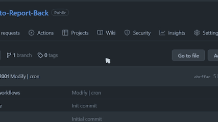
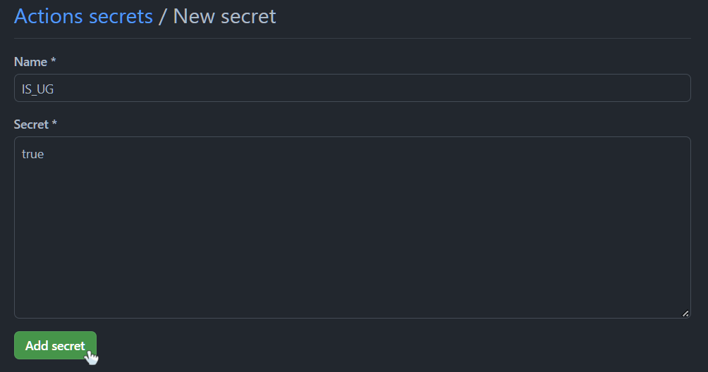
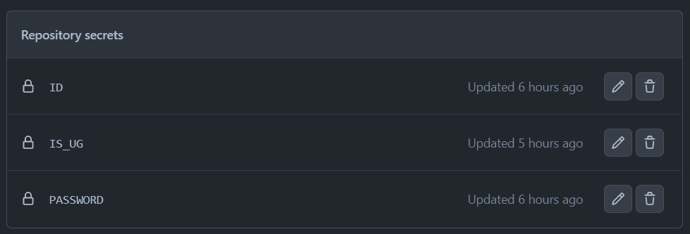
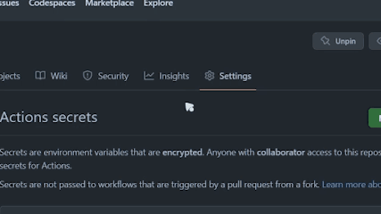
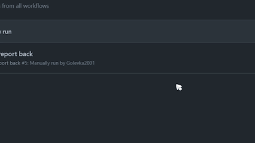

# :memo: SEU Auto Report Back

---

## :warning: **疫情时代产物，已废弃** :warning:

---

这是一个用于**东南大学**请假审批系统的**自动销假**脚本，支持使用 *GitHub Actions* 在线部署、定时运行，或部署在本地按需运行。

脚本自动登录到网上办事大厅，查询请假记录，若存在未销假记录，则执行销假操作。

可以免去每次请假前都要销上一次假的繁琐操作。

:link: 网上办事大厅的登录部分，以及使用 *GitHub Actions* 的想法参考了项目 [SEUAutoLogin](https://github.com/luzy99/SEUAutoLogin)，感谢！

## 目录

- [:memo: SEU Auto Report Back](#memo-seu-auto-report-back)
  - [:warning: **疫情时代产物，已废弃** :warning:](#warning-疫情时代产物已废弃-warning)
  - [目录](#目录)
  - [安全性](#安全性)
  - [使用说明](#使用说明)
    - [【:fire:推荐】使用 GitHub Actions 在线部署](#fire推荐使用-github-actions-在线部署)
      - [1. Fork 到个人仓库](#1-fork-到个人仓库)
      - [2. 变量配置](#2-变量配置)
      - [3. 检查 workflow 能否正常运行](#3-检查-workflow-能否正常运行)
      - [4. 修改定时任务（可选）](#4-修改定时任务可选)
    - [本地/服务器部署](#本地服务器部署)
      - [1. 填写配置文件](#1-填写配置文件)
      - [2. 修改部分代码](#2-修改部分代码)
  - [更新日志](#更新日志)
  - [使用许可](#使用许可)

## 安全性

此脚本的运行所需要的您的个人信息：

- 一卡通号
- 登录网上办事大厅的密码
- 本科生/研究生（本/研不共用请假审批系统）

在使用 *GitHub Actions* 在线部署、运行时，以上信息写在您个人仓库的 ```Actions secrets``` 中，加密存储，且脚本的运行过程中不会打印以上任何信息，以下是 GitHub 关于 ```Secrets``` 的介绍：

> Secrets are environment variables that are encrypted. Anyone with collaborator access to this repository can use these secrets for Actions.
> Secrets are not passed to workflows that are triggered by a pull request from a fork. [Learn more about encrypted secrets](https://docs.github.com/actions/automating-your-workflow-with-github-actions/creating-and-using-encrypted-secrets).

## 使用说明

### 【:fire:推荐】使用 GitHub Actions 在线部署

#### 1. Fork 到个人仓库

点击页面右上角的 ```Fork``` 按钮：


填写好仓库名后，点击下方绿色按钮 ```Create fork``` 完成创建。

#### 2. 变量配置

进入刚创建好的仓库 *xxx/SEU-Auto-Report-Back* 中，点击上方的 ```Settings``` 进入设置页面。

在左侧栏中找到 ```Secrets```，点击下拉后点击 ```Actions``` 。



点击绿色按钮 ```New repository secret``` 新建变量，依次建立三个变量：

| Name | Secret |
| :-: | :-: |
| ID | 一卡通号 |
| PASSWORD | 登录网上办事大厅的密码 |
| IS_UG | 是否为本科生：**true / false** |

:warning: ***注：请务必保证各变量的 Name 拼写正确和全大写，其中的 IS_UG 字段只能为 true（本科生）或 false（研究生）***

例如：



填写完成后点击绿色按钮 ```Add secret``` 完成添加。

最终添加完成后，应在 *Actions secrets* 页面可看到有如下**3个**变量：



配置完成。

#### 3. 检查 workflow 能否正常运行

点击上方的 ```Actions``` 按钮。

在左侧栏中切换到已配置好的自动销假 workflow：***auto report back***：

点击 ```Run workflow``` 按钮，触发工作流的运行：



稍等片刻，当此页面下出现 :white_check_mark:***auto report back*** 时表明执行完毕，进入查看执行结果。



在执行过程输出中找到 ```Report back``` 一栏点开，若执行结果显示为：

```bash
登录成功！
本科生组/研究生组  （正确的组别）
无需销假/销假成功
```

则配置正确。

#### 4. 修改定时任务（可选）

修改工作流文件 [auto_report_back.yml](./.github/workflows/auto_report_back.yml) 中的 ```on->schedule->cron``` 字段。

默认设定值如下，表示在每天的 *22:17 (UTC+08:00)* 执行一次脚本：

```yaml
on:
  schedule:
    - cron: '17 15 * * *'
```

:warning: ***注：1. 语法格式请参考 crontab 的语法； 2. 所填写的时间为 UTC 时间，即北京时间减8小时； 3. GitHub Actions 不保证准点运行，略有延后是正常的，尽量避开整点时间（多为高峰期），而选择较为随意的时间。***

### 本地/服务器部署

#### 1. 填写配置文件

本地部署需要使用到配置文件 [config.json](./config.json)：

```json
{
    "id": "123456789",
    "password": "******",
    "undergraduate": true
}
```

3个字段分别需要填写：**一卡通号**、**登录网上办事大厅的密码**、**是否为本科生**。

其中，```undergraduate``` 字段中，本科生填 ```true```，研究生填 ```false```，注意全小写且不加引号。

#### 2. 修改部分代码

打开文件 [report_back.py](./report_back.py)，从第 99 行开始的部分修改为如下内容：

*（即注释掉 GitHub Actions 版本的部分，并把原有的注释内容取消注释）*

```python
if __name__ == '__main__':
    """
    当前使用GitHub Actions在线部署，无需使用config.json写入个人信息。
    如果需要在本地运行，自行修改以下注释部分，将参数改为从配置文件读取，并编辑配置文件。
    """

    # 读取配置文件：
    with open('config.json', 'r', encoding='utf-8') as f:
        config = json.load(f)

    # # 读取环境变量：
    # id = os.environ['ID']
    # password = os.environ['PASSWORD']
    # if os.environ['IS_UG'] == 'true':
    #     is_ug = True
    # else:
    #     is_ug = False

    # 登录：
    try:
        ss = login_ehall(config['id'], config['password'])
        # ss = login_ehall(id, password)
    except Exception as e:
        print(e)
        exit(-1)

    # 销假：
    try:
        report_back(ss, config['id'], config['undergraduate'])
        # report_back(ss, id, is_ug)
    except Exception as e:
        print(e)
        exit(-1)
```

## 更新日志

**2022-12-12:**

1. 新增对 *GitHub Actions* 的支持，能够在线部署、定时运行；
2. 区分本科生、研究生的不同请假审批系统。

## 使用许可

[GNU GENERAL PUBLIC LICENSE v3.0 © Gol3vka.](./LICENSE)
